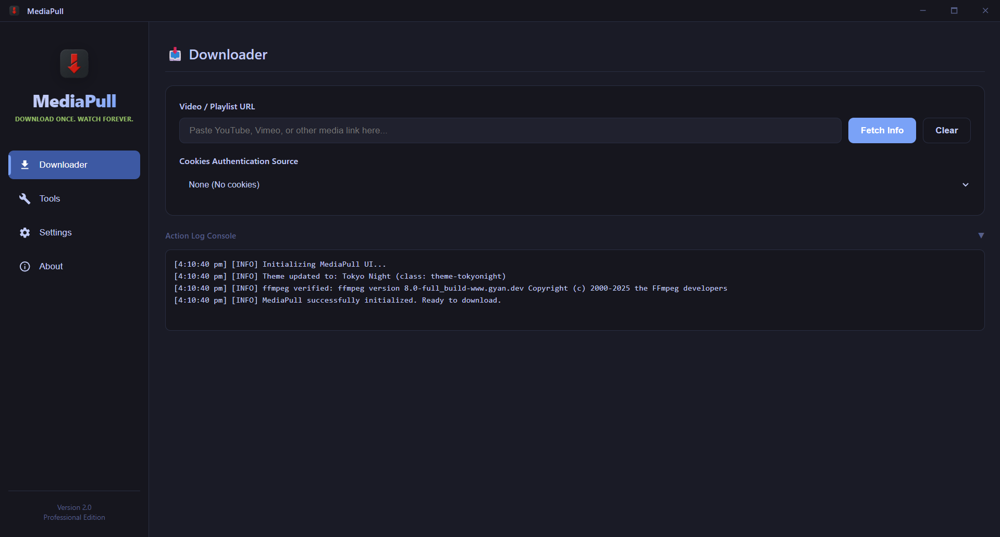
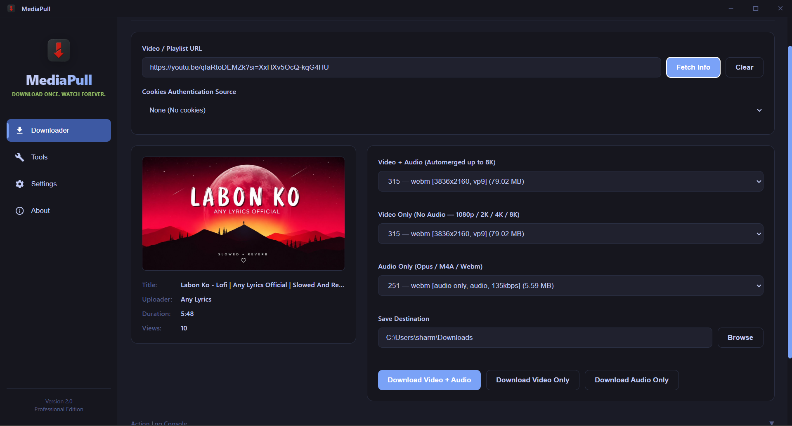
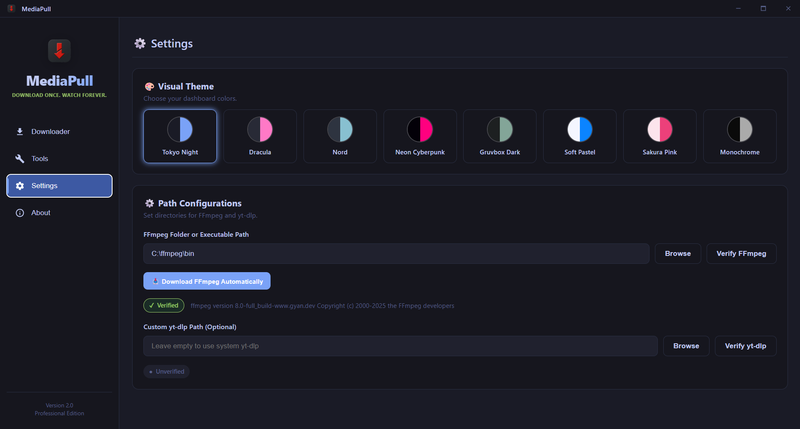
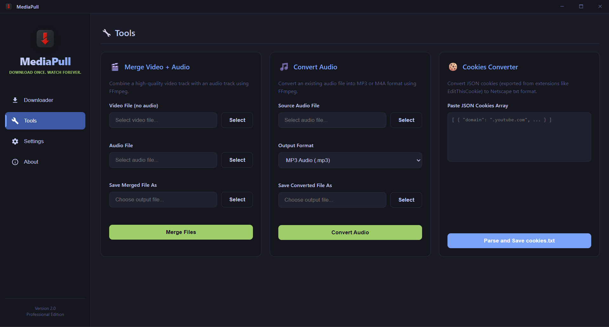
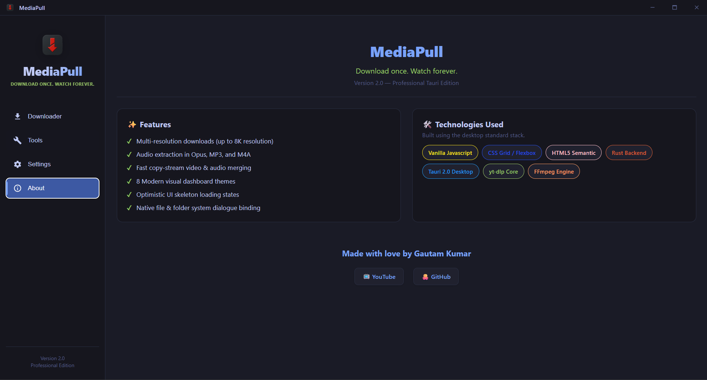

# MediaPull
**Download once. Watch forever.**

MediaPull is a professional, high-performance video downloader and media management desktop application for Windows, macOS, and Linux. Built with Tauri 2.0, Rust, and Vanilla Web technologies (HTML/JS/CSS), it provides a fast, native, and premium single-window dashboard experience.

**Made with love by Gautam Kumar**

---

## 📸 Project Showcase

<p align="center">
  
  
</p>
<p align="center">
  
  
</p>
<p align="center">
  
</p>

---

## ✨ Features

- **🎬 Multi-Format Downloads**
  - Progressive download (video + audio combined up to 1080p)
  - High-Resolution DASH (video only) for 2K, 4K, 8K resolutions
  - Audio extraction in Opus, MP3, and M4A
  
- **🔧 Integrated Media Tools**
  - **Merge Video + Audio**: Combine separate video and audio tracks with FFmpeg
  - **Convert Audio**: Convert any audio source to high-quality MP3 or M4A (AAC)
  - **Cookies Parser**: Paste raw JSON cookies (e.g. from EditThisCookie) and parse them into a Netscape `cookies.txt` file directly inside the GUI

- **🎨 Premium Visual Themes**
  - Switch between 8 professionally designed dark and light themes instantly:
    - Tokyo Night (Default)
    - Neon Cyberpunk
    - Dracula
    - Nord
    - Gruvbox Dark
    - Soft Pastel (Light)
    - Sakura Pink (Light)
    - Monochrome
  - Settings and preferences are automatically saved in local storage

- **⚡ Perceived Speed Optimizations**
  - **Skeleton Loading Cards**: Displays instant placeholder loading blocks when fetching video info
  - **Memory Cache**: Remembers the last 10 URL requests for instant 0ms reload
  - **Throttled GUI Updates**: Throttles download progress redraws to 10 updates/sec to maintain a smooth 60 FPS UI thread
  - **Background Worker Threads**: yt-dlp and FFmpeg subprocesses run asynchronously on Rust background worker threads, preventing GUI stutter

- **⚙️ Executable Customization**
  - Custom path configuration for FFmpeg and yt-dlp inside the Settings panel with instant verification badges

---

## 🚀 Setup and Development

### Prerequisites
- **Node.js** (v18+) & **npm**
- **Rust Toolchain** (rustc, cargo)
- **FFmpeg** (configured via Settings or system path for merging and conversions)
- **yt-dlp** (configured via Settings or system path for media extraction)

### Quick Start

1. **Install Frontend Dependencies:**
   ```bash
   npm install
   ```

2. **Run in Development Mode:**
   ```bash
   npm run tauri dev
   ```

3. **Build the Production Installer:**
   ```bash
   npm run tauri build
   ```
   The compiled standalone executable/installer will be saved in `src-tauri/target/release/bundle/`.

---

## 🛠️ Technology Stack
- **Frontend**: HTML5, Vanilla CSS Grid/Flexbox, Vanilla ES6 JavaScript
- **Backend**: Rust, Tauri 2.0 framework
- **Dialog Binding**: `rfd` (Rust File Dialog) for native explorer dialogs
- **Subprocesses**: Native Rust Command pipes with Tokio async wrapper
- **Media Engines**: yt-dlp & FFmpeg
